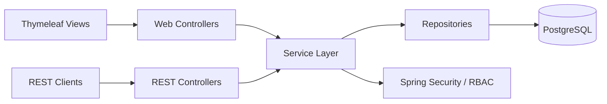
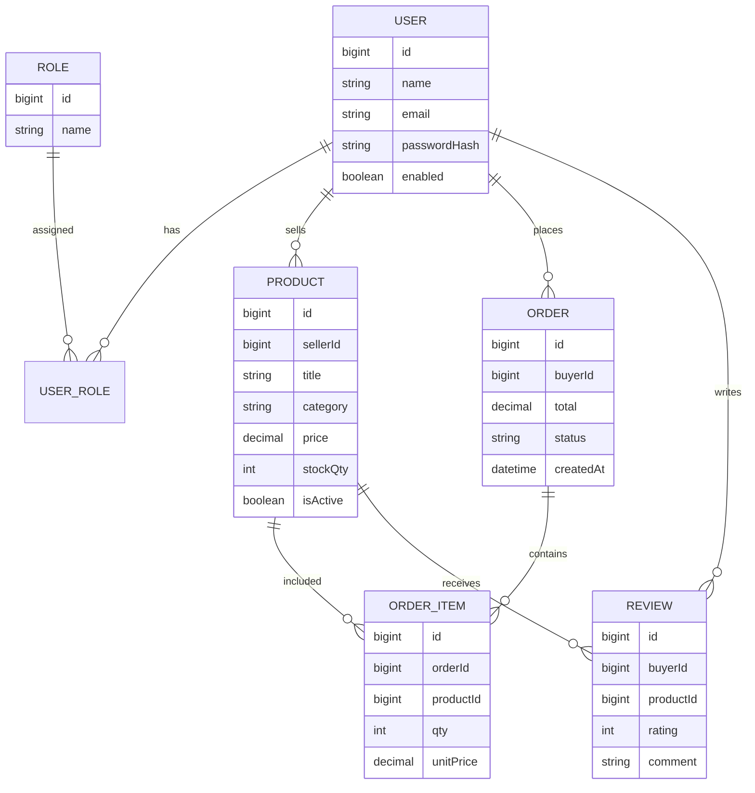

# CSE 3220 — Software Engineering Lab Project
## Mini Marketplace (Admin / Seller / Buyer) — Spring Boot + Thymeleaf + PostgreSQL + DevOps Pipeline

> This repository follows the **CSE 3220 Software Engineering Lab Project Guidelines**: a small but complete full‑stack web application with **Spring Boot**, **Thymeleaf**, **PostgreSQL**, **Spring Security (RBAC)**, **Docker**, **GitHub Actions CI/CD**, and **Render** deployment.

---

## Team
This is a **2-person** project (required by the guideline).

- Member 1: Rakibul Islam — ID: 2107008
- Member 2: Ruhan Ahsan Sarnav — ID: 2107025: 

---

## Objective
Build a minimal but professional marketplace demonstrating:
- Layered architecture, clean code, DTO usage, global exception handling
- Authentication + role-based authorization (**ADMIN**, **SELLER**, **BUYER**)
- RESTful API design + server-side rendered UI (Thymeleaf)
- PostgreSQL relational design with proper JPA mappings
- Automated tests (unit + integration) executed in CI
- Dockerized local run (`docker compose up --build`)
- Git workflow (main/develop/feature branches + PR review)
- CI/CD to Render (auto deploy from `main`)

---

## Guideline Compliance (Checklist)
This section maps directly to the requirements in the provided course guideline.

### 1) Authentication & Authorization (Spring Security)
- User registration + login/logout
- Password encryption using **BCrypt**
- Role-based authorization: **ADMIN**, **SELLER**, **BUYER**
- Access enforcement using URL security and/or method-level security (`@PreAuthorize`)

### 2) REST API Design
- REST principles (HTTP methods, status codes)
- Global exception handling (`@ControllerAdvice`)
- Minimum controllers: **Auth**, **Product**, **Order** (also includes **Admin**, **Review**)
- CRUD for at least 2 main entities (Products + Orders)

### 3) Database (PostgreSQL + JPA)
- Minimum 4 tables: users/roles/products/orders (also includes order_items, reviews)
- Proper relationships (1:M and M:M via join table)

### 4) Testing
- Unit tests (service layer) with JUnit + Mockito (minimum: **15**)
- Integration tests (controller layer) with SpringBootTest + MockMvc (minimum: **3**)
- Tests executed in GitHub Actions CI

### 5) Dockerization
- `Dockerfile` + `docker-compose.yml` for app + PostgreSQL
- Environment variables for credentials (no hardcoded secrets)
- Runs with `docker compose up --build`

### 6) GitHub Requirements
- Branch strategy: `main` (protected), `develop`, `feature/*`
- No direct push to `main` (PR + at least one review approval)

### 7) CI/CD Pipeline
- GitHub Actions: build + test + deploy to Render on push to `main`

### 8) Deployment
- Deployed on Render (public URL)

---

## Automatic Failure Conditions (per guideline)
- No role-based access control
- Direct push to `main`
- No Dockerization
- Tests not implemented
- App not deployed

## Roles & Functional Requirements

### Admin
- Approve / reject sellers
- Monitor transactions (orders/payments)
- Remove fraudulent listings

### Seller
- Add / update / delete products
- Manage stock

### Buyer
- Browse products
- Add to cart & purchase
- Give reviews

### Unique features
- Smart search using filters (price range, category)
- Order tracking (status timeline)

### Advanced idea (implemented as algorithmic feature)
**Graph-based recommendations**: “People who bought X also bought Y”
- A co-purchase **item–item graph** is built from completed orders.
- Recommendations are ranked using:
  - Java `Map<ProductId, Map<ProductId, Integer>>` for adjacency weights
  - Java `PriorityQueue` for top‑K ranking (STL analog: `map` + `priority_queue`)

---

## Architecture
Layered architecture (Controller → Service → Repository):
- **Controller layer**: REST endpoints and Thymeleaf web controllers
- **Service layer**: business logic (checkout, stock updates, recommendations)
- **Repository layer**: Spring Data JPA repositories
- **Security layer**: Spring Security config, RBAC, BCrypt

### High-level diagram (Mermaid)

### Key design decisions
- Soft delete for fraudulent listings: `Product.isActive=false` (orders remain consistent)
- Stock integrity: stock is decremented during checkout inside a transactional service method
- Recommendation graph is updated after successful purchase

---

## Database Design

### Entities (minimum 4 tables)
- `users`
- `roles`
- `products`
- `orders`
- `order_items`
- `reviews` (optional but included)

### ER diagram (Mermaid)

---

## API Endpoints (REST)
Minimum requirement: **≥ 3 controllers** and CRUD for **≥ 2 entities**.

### Auth Controller
- `POST /api/auth/register` — register user (buyer/seller)
- `POST /api/auth/login` — login
- `POST /api/auth/logout` — logout

### Product Controller
- `GET /api/products` — list/search products (filters: category, minPrice, maxPrice)
- `GET /api/products/{id}` — product details
- `POST /api/seller/products` — create product (**SELLER**)
- `PUT /api/seller/products/{id}` — update product (**SELLER**, owner only)
- `DELETE /api/seller/products/{id}` — delete/disable product (**SELLER**, owner only)

### Order Controller
- `POST /api/buyer/cart/items` — add to cart (**BUYER**)
- `GET /api/buyer/cart` — view cart (**BUYER**)
- `POST /api/buyer/orders/checkout` — purchase (**BUYER**)
- `GET /api/buyer/orders/{orderId}` — order tracking/status timeline (**BUYER**)

### Admin Controller
- `GET /api/admin/sellers/pending` — list pending sellers (**ADMIN**)
- `POST /api/admin/sellers/{sellerId}/approve` — approve seller (**ADMIN**)
- `POST /api/admin/sellers/{sellerId}/reject` — reject seller (**ADMIN**)
- `GET /api/admin/transactions` — monitor transactions (**ADMIN**)
- `POST /api/admin/products/{productId}/deactivate` — remove fraudulent listing (**ADMIN**)

### Review Controller
- `POST /api/buyer/products/{productId}/reviews` — add review (**BUYER**)
- `GET /api/products/{productId}/reviews` — view reviews

> Notes
- All endpoints use proper HTTP status codes.
- Global exception handling is applied using `@ControllerAdvice`.
- DTOs are used for request/response payloads.

---

## Authorization Matrix (RBAC)
| Feature | ADMIN | SELLER | BUYER |
|---|---:|---:|---:|
| Register/Login/Logout | ✅ | ✅ | ✅ |
| Browse/search products | ✅ | ✅ | ✅ |
| Add/update/delete products | ✅ (moderation only) | ✅ | ❌ |
| Manage stock | ❌ | ✅ | ❌ |
| Cart/Checkout | ❌ | ❌ | ✅ |
| Reviews | ❌ | ❌ | ✅ |
| Approve/reject sellers | ✅ | ❌ | ❌ |
| Monitor transactions | ✅ | ❌ | ❌ |
| Remove fraudulent listings | ✅ | ❌ | ❌ |

---

## Smart Search (Filters)
Search supports:
- `category` (exact match)
- `minPrice` / `maxPrice` (range)

Implementation idea:
- Use JPA query methods / Specifications.
- Return only `isActive=true` products.

---

## Order Tracking
Orders include:
- `status` (e.g., PLACED → PAID → SHIPPED → DELIVERED)
- `statusHistory` (timestamped timeline)

Buyer sees a tracking view / endpoint showing the history.

---

## Recommendation System (Graph Algorithm)

### Co-purchase item graph
- For each completed order with items `{p1, p2, ..., pk}`:
  - For every pair `(pi, pj)`, increment co-buy weight

### Ranking
- For a product `X`, recommend top‑K neighbors with highest co-buy weight:
  - Use `PriorityQueue` to pop highest score first

---

## Tech Stack
- Backend: Spring Boot
- UI: Thymeleaf
- Security: Spring Security + BCrypt
- DB: PostgreSQL
- Build: Maven or Gradle
- Tests: JUnit 5, Mockito, SpringBootTest, MockMvc
- Containerization: Docker + Docker Compose
- CI/CD: GitHub Actions
- Deployment: Render

---

## How to Run (Docker) — Required
Prerequisite: Docker Desktop

1. Create an `.env` file (example keys):
   - `POSTGRES_DB=marketplace`
   - `POSTGRES_USER=marketplace_user`
   - `POSTGRES_PASSWORD=marketplace_pass`
   - `SPRING_DATASOURCE_URL=jdbc:postgresql://db:5432/marketplace`
   - `SPRING_DATASOURCE_USERNAME=marketplace_user`
   - `SPRING_DATASOURCE_PASSWORD=marketplace_pass`

2. Build and run:
   - `docker compose up --build`

3. Open:
   - `http://localhost:8080`

---

## How to Run (Local Dev)
Prerequisites:
- JDK 17+
- PostgreSQL 14+

Steps:
1. Create database + user
2. Configure `application.yml` / env vars
3. Run:
   - `./mvnw spring-boot:run` (or `./gradlew bootRun`)

---

## Testing — Required
Guideline requirement:
- Minimum **15 unit tests** (Service layer)
- Minimum **3 integration tests** (Controller layer with `MockMvc`)

Run tests:
- `./mvnw test`

CI must run tests successfully on every PR and on `main`.

---

## Dockerization — Required
Repository includes:
- `Dockerfile` for application
- `docker-compose.yml` for app + PostgreSQL
- Env variables for secrets (no hardcoded credentials)

Expected run command:
- `docker compose up --build`

---

## Git Workflow — Required
- Branches:
  - `main` (protected)
  - `develop`
  - `feature/*`
- Rules:
  - No direct push to `main`
  - PR required + at least 1 review approval

---

## CI/CD Pipeline (GitHub Actions) — Required
GitHub Actions workflow must:
1. Checkout code
2. Build project
3. Run tests
4. Build Docker image (optional but recommended)
5. Deploy to Render automatically on push to `main`

---

## Deployment (Render) — Required
- Live URL: **<RENDER_APP_URL>**
- GitHub repo: **<GITHUB_REPO_URL>**

---

## Deliverables Checklist (per guideline)
- ✅ GitHub repository
- ✅ README with description, architecture diagram, ER diagram, API endpoints, run instructions, CI/CD explanation
- ⬜ Deployed URL (Render)
- ⬜ 5-minute demo presentation

---

## License
For academic use (CSE 3220).
